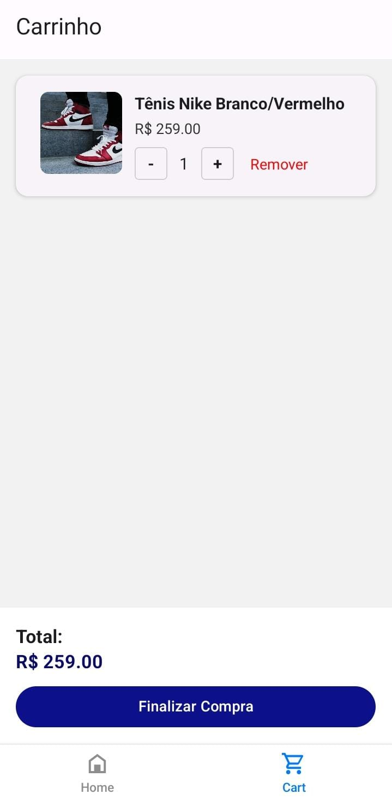
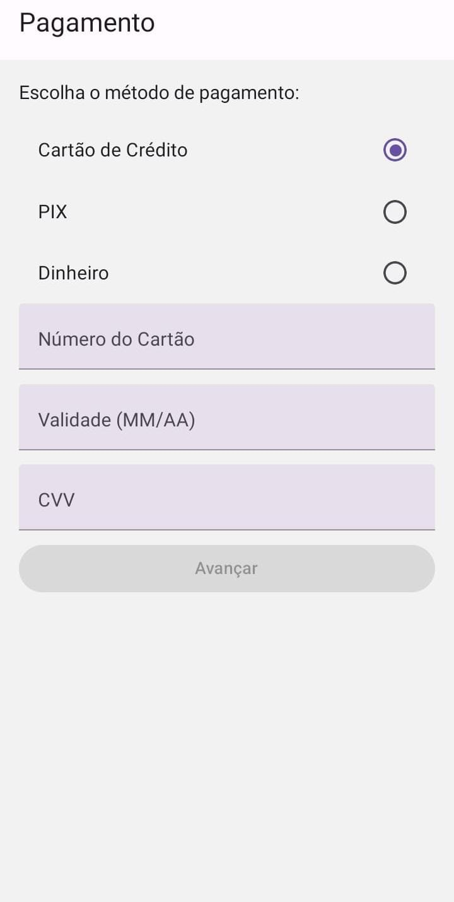
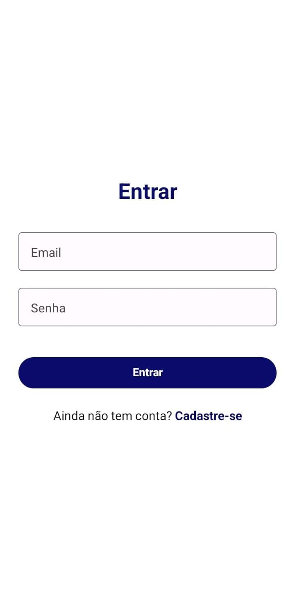

# 🛍️ Aplicativo de E-commerce - React Native (Desafio Técnico Macle)

Este é um aplicativo mobile de e-commerce desenvolvido em **React Native com Expo**, como parte de um desafio técnico. Ele possui funcionalidades completas como autenticação, carrinho persistente, formas de pagamento, entrega e histórico de pedidos.

## 🖼️ Telas do Aplicativo

<table align="center">
  <tr>
    <td align="center">
      <br/>
      <strong>🏠 Home</strong>
    </td>
    <td align="center">
      <br/>
      <strong>🛒 Carrinho</strong>
    </td>
  </tr>
  <tr>
    <td align="center">
      <br/>
      <strong>💳 Pagamento</strong>
    </td>
    <td align="center">
      <br/>
      <strong>👤 Login</strong>
    </td>
  </tr>
</table>


---

## 🚀 Tecnologias Utilizadas

| Tecnologia              | Finalidade                                                  |
| ----------------------- | ----------------------------------------------------------- |
| **React Native + Expo** | Framework mobile multiplataforma com suporte ao Expo Go     |
| **React Navigation**    | Navegação aninhada com pilhas e abas                        |
| **React Native Paper**  | Componentes visuais modernos e acessíveis                   |
| **Context API**         | Gerenciamento de estado global                              |
| **AsyncStorage**        | Persistência local por usuário (carrinho, pedidos, etc.)    |
| **json-server-auth**    | API mock com suporte a autenticação JWT                     |
| **Render**              | Hospedagem da(s) API(s) com dados e autenticação para o app |
| **TypeScript**          | Tipagem segura em todos os arquivos                         |

---

## 📦 Pré-requisitos

- Node.js e npm instalados
- Expo CLI:
  ```bash
  npm install -g expo-cli
  ```

App Expo Go instalado no celular
(disponível na App Store / Google Play)

### 🔧 Instalação

1 - Clone o repositório:

```json
git clone https://github.com/LuizHRDC/react-native-ecommerce.git
```

2 - Acesse o diretório do projeto:

```json
cd vitrine
```

3 - Instale as dependências:

```json
npm install
```

### ▶️ Como rodar o projeto

Você pode rodar com ou sem túnel, dependendo da sua rede.

✅ Opção 1: Rodar com túnel (recomendado)
Funciona mesmo fora da rede local. Ideal para rodar no celular com Expo Go.

```json
npm run start
```

Script definido em `package.json`:

```json
"start": "expo start --tunnel"
```

### ⚡ Opção 2: Rodar na mesma rede (modo LAN)

Mais rápido, mas só funciona com dispositivos na mesma rede Wi-Fi.

```json
npm run start:lan
```

Script definido em `package.json`:

```json
"start:lan": "expo start"
```

### 📱 Usar no celular com Expo Go

Abra o app Expo Go no seu celular

Escaneie o QR Code exibido no terminal ou navegador após rodar o comando

O app será carregado automaticamente no seu dispositivo

No primeiro acesso é possível que haja um delay causado pelo acesso às APIs de Registro e Produtos

### 📄 Informações da API

```text
As APIs utilizadas estão hospedadas no Render:

API de produtos e pedidos:
https://ecommerce-api-99h8.onrender.com

API de autenticação com JWT (json-server-auth):
https://auth-api-wixi.onrender.com

Ambas estão integradas ao app com base em variáveis e serviços.
```

```text
✅ Status
Todas as funcionalidades descritas no desafio foram implementadas com sucesso.
```
